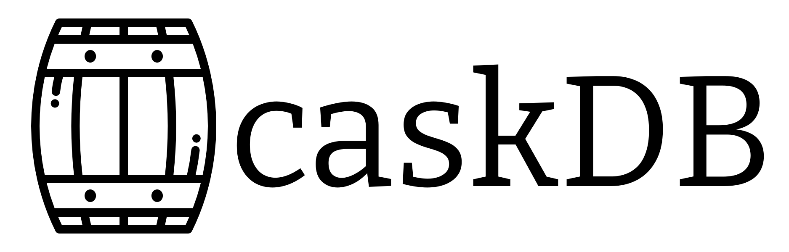

# CaskDB - Disk based Log Structured Hash Table Store


[](https://github.com/avinassh/py-caskdb/actions/workflows/build.yml)
[](https://codecov.io/gh/avinassh/py-caskdb)
[](https://github.com/avinassh/py-caskdb/blob/master/LICENSE)
[](https://twitter.com/iavins)


CaskDB is a  disk-based, embedded, persistent, key-value store based on the [Riak's bitcask paper](https://riak.com/assets/bitcask-intro.pdf), written in Python. It is more focused on the educational capabilities than using it in production. The file format is platform, machine, and programming language independent. Say, the database file created from Python on macOS should be compatible with Rust on Windows.

This project aims to help anyone, even a beginner in databases, build a persistent database in a few hours. There are no external dependencies; only the Python standard library is enough.

If you are interested in writing the database yourself, head to the workshop section.

## Features
- Low latency for reads and writes
- High throughput
- Easy to back up / restore 
- Simple and easy to understand
- Store data much larger than the RAM

## Limitations
Most of the following limitations are of CaskDB. However, there are some due to design constraints by the Bitcask paper.

- Single file stores all data, and deleted keys still take up the space
- CaskDB does not offer range scans
- CaskDB requires keeping all the keys in the internal memory. With a lot of keys, RAM usage will be high 
- Slow startup time since it needs to load all the keys in memory

## Dependencies
CaskDB does not require any external libraries to run. For local development, install the packages from [requirements_dev.txt](requirements_dev.txt):
	
	pip install -r requirements_dev.txt

## Installation
PyPi is not used for CaskDB yet ([issue #5](https://github.com/avinassh/py-caskdb/pull/5)), and you'd have to install it directly from the repository by cloning.

## Usage

```python
disk: DiskStorage = DiskStore(file_name="books.db")
disk.set(key="othello", value="shakespeare")
author: str = disk.get("othello")
# it also supports dictionary style API too:
disk["hamlet"] = "shakespeare"
```
	
## Prerequisites
The workshop is for intermediate-advanced programmers. Knowing Python is not a requirement, and you can build the database in any language you wish. 

Not sure where you stand? You are ready if you have done the following in any language:
- If you have used a dictionary or hash table data structure
- Converting an object (class, struct, or dict) to JSON and converting JSON back to the things
- Open a file to write or read anything. A common task is dumping a dictionary contents to disk and reading back

## Workshop
**NOTE:** I don't have any [workshops](workshop.md) scheduled shortly. [Follow me on Twitter](https://twitter.com/iavins/) for updates. [Drop me an email](http://scr.im/avii) if you wish to arrange a workshop for your team/company.

CaskDB comes with a full test suite and a wide range of tools to help you write a database quickly. [A Github action](https://github.com/avinassh/py-caskdb/blob/master/.github/workflows/build.yml) is present with an automated tests runner, code formatter, linter, type checker and static analyser. Fork the repo, push the code, and pass the tests!

Throughout the workshop, you will implement the following:
- Serialiser methods take a bunch of objects and serialise them into bytes. Also, the procedures take a bunch of bytes and deserialise them back to the things.
- Come up with a data format with a header and data to store the bytes on the disk. The header would contain metadata like timestamp, key size, and value.
- Store and retrieve data from the disk
- Read an existing CaskDB file to load all keys

### Tasks
1. Read [the paper](https://riak.com/assets/bitcask-intro.pdf). Fork this repo and checkout the `start-here` branch
2. Implement the fixed-sized header, which can encode timestamp (uint, 4 bytes), key size (uint, 4 bytes), value size (uint, 4 bytes) together
3. Implement the key, value serialisers, and pass the tests from `test_format.py`
4. Figure out how to store the data on disk and the row pointer in the memory. Implement the get/set operations. Tests for the same are in `test_disk_store.py`
5. Code from the task #2 and #3 should be enough to read an existing CaskDB file and load the keys into memory

Use `make lint` to run mypy, black, and pytype static analyser. Run `make test` to run the tests locally. Push the code to Github, and tests will run on different OS: ubuntu, mac, and windows.

Not sure how to proceed? Then check the [hints](hints.md) file which contains more details on the tasks and hints.

### Hints
- Check out the documentation of [struck.pack](https://docs.python.org/3/library/struct.html#struct.pack) for serialisation methods in Python
- Not sure how to come up with a file format? Read the comment in the [format module](format.py)

## What next?
I often get questions about what is next after the basic implementation. Here are some challenges (with different levels of difficulties)

### Level 1:
- Crash safety: the bitcask paper stores CRC in the row, and while fetching the row back, it verifies the data
- Key deletion: CaskDB does not have a delete API. Read the paper and implement it
- Instead of using a hash table, use a data structure like the red-black tree to support range scans
- CaskDB accepts only strings as keys and values. Make it generic and take other data structures like int or bytes.
- While startup, current implementation loads values into memory. This is unnecessary and can be avoided. Just skip the value bytes and reading just the keys enough to build KeyDir

### Level 2:
- Hint file to improve the startup time. The paper has more details on it
- Implement an internal cache which stores some of the key-value pairs. You may explore and experiment with different cache eviction strategies like LRU, LFU, FIFO etc.
- Split the data into multiple files when the files hit a specific capacity

### Level 3:
- Support for multiple processes
- Garbage collector: keys which got updated and deleted remain in the file and take up space. Write a garbage collector to remove such stale data
- Add SQL query engine layer
- Store JSON in values and explore making CaskDB as a document database like Mongo
- Make CaskDB distributed by exploring algorithms like raft, paxos, or consistent hashing

## Name
This project was named cdb earlier and now renamed to CaskDB.

## Line Count

```shell
$ tokei -f format.py disk_store.py
===============================================================================
 Language            Files        Lines         Code     Comments       Blanks
===============================================================================
 Python                  2          391          261          103           27
-------------------------------------------------------------------------------
 disk_store.py                      204          120           70           14
 format.py                          187          141           33           13
===============================================================================
 Total                   2          391          261          103           27
===============================================================================
```

## License
The MIT license. Please check `LICENSE` for more details.
